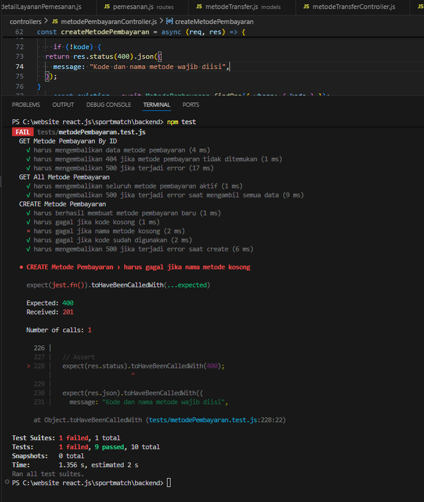
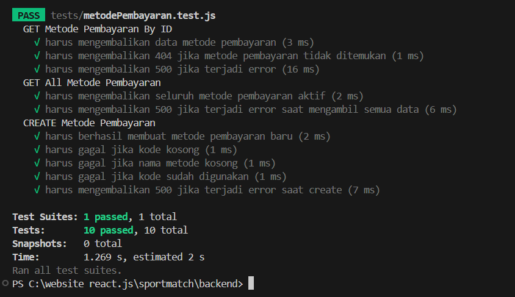
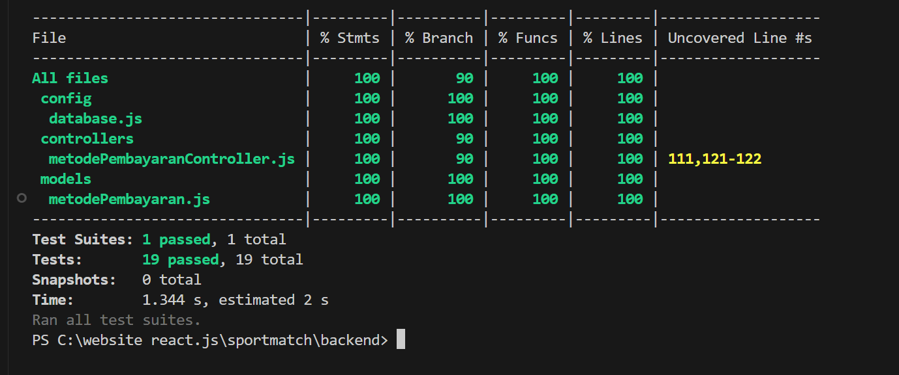
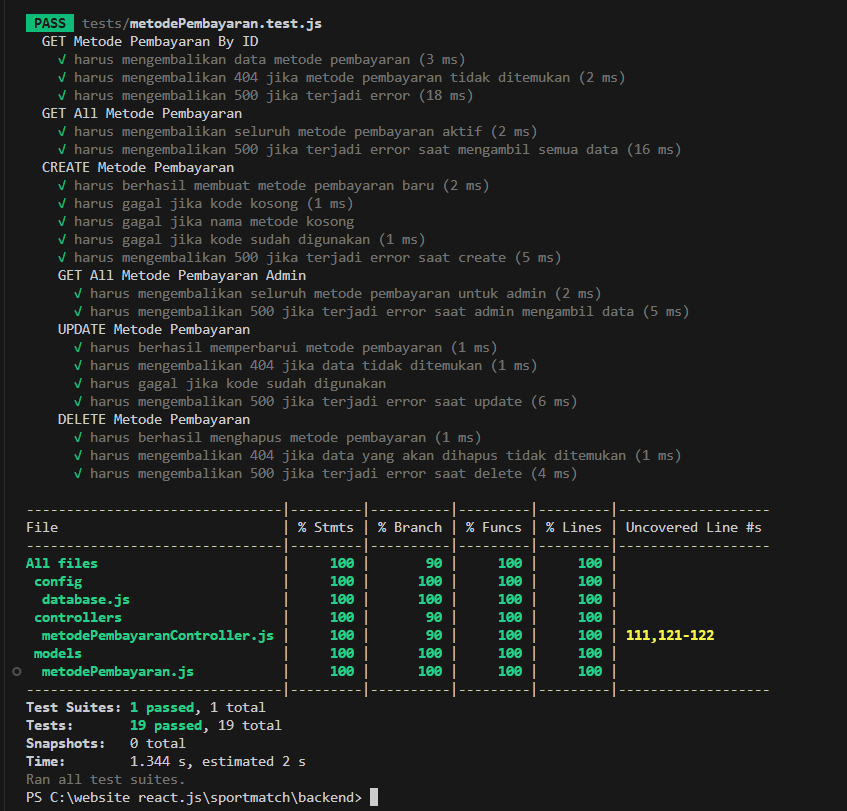
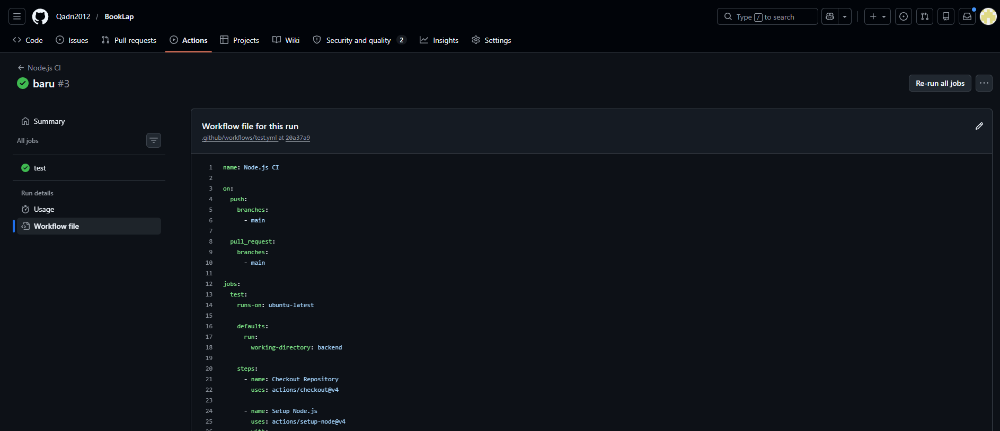

[](https://github.com/Qadri2012/BookLap/actions/workflows/test.yml)

# BookLap — Regression Test Suite

## Deskripsi Project

BookLap merupakan aplikasi pemesanan lapangan olahraga berbasis web yang dikembangkan menggunakan React.js, Vite, Express.js, Sequelize, dan MySQL.

Pada tugas ini dilakukan implementasi **Regression Test Suite** menggunakan Jest dan Supertest untuk memastikan perubahan kode tidak menyebabkan kerusakan pada fungsionalitas yang sudah berjalan sebelumnya.

---

## Tujuan Pengujian

Tujuan regression testing adalah:

- Memastikan endpoint tetap berfungsi setelah terjadi perubahan kode.
- Mendeteksi bug atau regresi yang muncul akibat modifikasi program.
- Menjamin kualitas dan stabilitas API.
- Mengotomatisasi proses pengujian menggunakan GitHub Actions.

---

## Endpoint yang Diuji

```text
/api/v1/metode-pembayaran
```

Controller yang diuji:

```text
backend/controllers/metodePembayaranController.js
```

---

## Teknologi yang Digunakan

| Kategori | Teknologi |
|----------|-----------|
| Backend  | Node.js, Express.js, Sequelize, MySQL |
| Frontend | React.js, Vite |
| Testing  | Jest, Supertest, GitHub Actions |

---

## Cara Menjalankan Project

### Menjalankan Backend

```bash
cd backend
npm install
npm run dev
```

### Menjalankan Frontend

```bash
cd frontend
npm install
npm run dev
```

---

## Menjalankan Regression Test

Masuk ke folder backend:

```bash
cd backend
```

Menjalankan seluruh test:

```bash
npm test
```

Menjalankan code coverage:

```bash
npx jest --coverage
```

---

## Daftar Test Case

### GET Metode Pembayaran By ID

| Kode | Deskripsi |
|------|-----------|
| TC-01 | Data ditemukan |
| TC-02 | Data tidak ditemukan (404) |
| TC-03 | Error database (500) |

### GET All Metode Pembayaran

| Kode | Deskripsi |
|------|-----------|
| TC-04 | Berhasil mengambil seluruh data aktif |
| TC-05 | Error database (500) |

### CREATE Metode Pembayaran

| Kode | Deskripsi |
|------|-----------|
| TC-06 | Berhasil membuat data |
| TC-07 | Kode kosong |
| TC-08 | Nama metode kosong |
| TC-09 | Kode sudah digunakan |
| TC-10 | Error database (500) |

### GET All Metode Pembayaran Admin

| Kode | Deskripsi |
|------|-----------|
| TC-11 | Berhasil mengambil seluruh data admin |
| TC-12 | Error database (500) |

### UPDATE Metode Pembayaran

| Kode | Deskripsi |
|------|-----------|
| TC-13 | Berhasil memperbarui data |
| TC-14 | Data tidak ditemukan |
| TC-15 | Kode sudah digunakan |
| TC-16 | Error database (500) |

### DELETE Metode Pembayaran

| Kode | Deskripsi |
|------|-----------|
| TC-17 | Berhasil menghapus data |
| TC-18 | Data tidak ditemukan |
| TC-19 | Error database (500) |

> **Total test case yang berhasil dijalankan: 19 Test Case**

---

## Implementasi Regression Testing

Regression testing dilakukan dengan mensimulasikan perubahan kode pada validasi endpoint **Create Metode Pembayaran**.

Validasi awal:

```javascript
if (!kode || !nama_metode) {
```

Kemudian diubah menjadi:

```javascript
if (!kode ) {
```

Perubahan tersebut menyebabkan test case validasi gagal karena sistem tetap menerima data yang seharusnya ditolak.




Hasil pengujian menunjukkan bahwa **regression test berhasil mendeteksi perubahan yang menyebabkan bug**.

Setelah kode dikembalikan ke kondisi semula, seluruh test kembali berhasil dijalankan.

---

## Hasil Code Coverage

| Metric | Hasil |
|--------|-------|
| Statements | 100% |
| Functions  | 100% |
| Lines      | 100% |
| Branches   | 90%  |

> Hasil tersebut telah melampaui target minimal **75% code coverage** yang ditentukan pada tugas.

### Screenshot Coverage



### Detail Coverage



---

## Continuous Integration (GitHub Actions)

Project telah menggunakan **GitHub Actions** untuk menjalankan regression test secara otomatis setiap kali terjadi push ke repository.

Lokasi workflow:

```text
.github/workflows/test.yml
```

Proses yang dijalankan:

1. Checkout repository
2. Install dependency
3. Menjalankan Jest Test Suite
4. Menampilkan status berhasil atau gagal

### Hasil GitHub Actions

Workflow berhasil dijalankan dengan status **Success**.



---

## Kesimpulan

Regression Test Suite berhasil diimplementasikan pada endpoint **Metode Pembayaran** menggunakan Jest dan Supertest.

Pengujian berhasil:

- Menjalankan **19 test case**.
- Mendeteksi regresi ketika terjadi perubahan validasi.
- Mencapai **100% line coverage**.
- Terintegrasi dengan **GitHub Actions** untuk pengujian otomatis.

Dengan demikian seluruh kebutuhan tugas Implementasi Regression Test Suite telah berhasil dipenuhi.

NAMA : MUHAMMAD IQBAL (231011085)
       DELVINA DWI AMANDA (231011104)